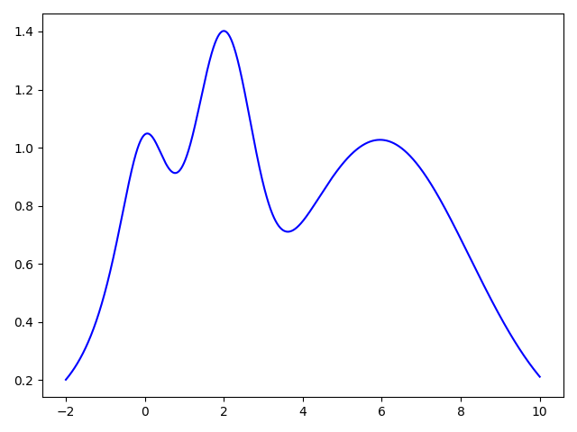
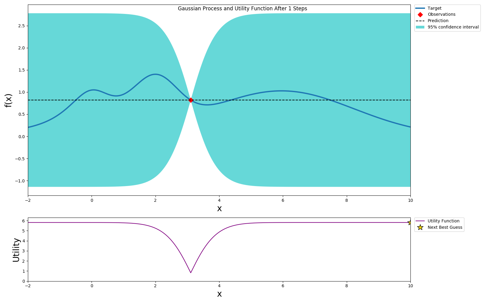
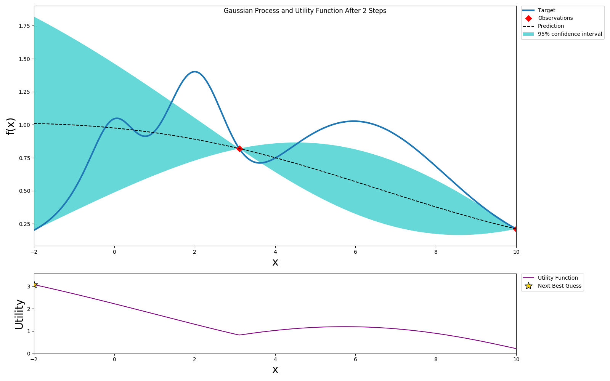
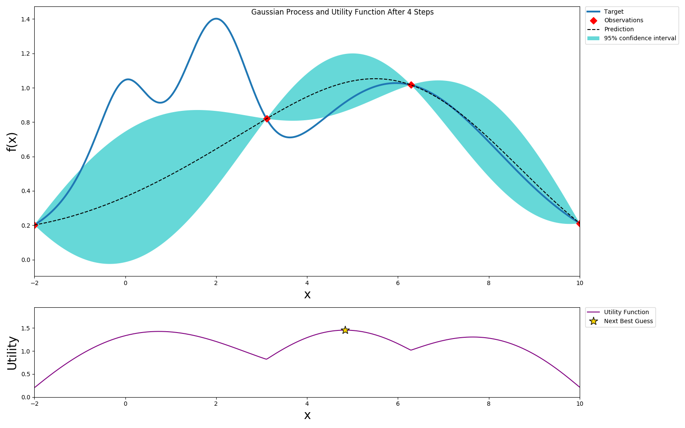
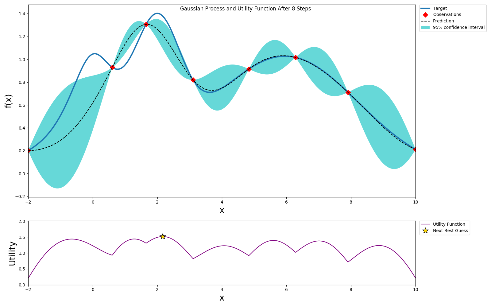
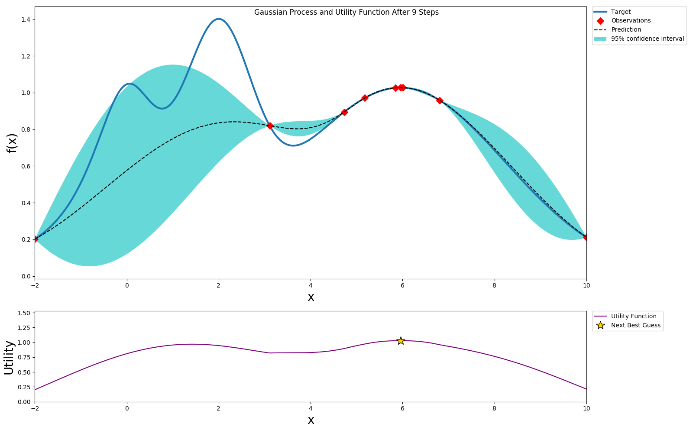

# Bayesian Optimization

Model training is an expensive process and each time we want to evaluate a hyperparameter vector, we have to run this process.
This makes grid search very expensive as it is exponential in the number of hyperparameters. Random search may also need many iterations to get to a good hyperparameter vector as it is randomly trying out different options.
Before automatic hyperparameter tuning was wide spread, the common mechanism for finding a good set of hyperparameters was to use `Grad Student Descent` or `Intern Descent`. Human reasoning often follows a bayesian model, where we try out something and then iteratively pick what we think is a `good` next set of values to try. Systems in the real world often fit a probability distribution, like a normal distribution. Bayesian optimization models the hyperparameter vector performance as a distribution, often a Gaussian process. We then try to optimize the performance of this function. We also naturally make the trade off between exploration and exploitation. If the term paper is due tomorrow or if there is a release deadline, we may choose to optimize amongst the known best performing values. If we have a few months to try out different options, we may choose to try out a wider range of values.

Bayesian optimization follows a similar pattern with user configurable parameters to control the amount of exploration vs exploitation. Let us see how this works starting with an example based on the [bayes_opt](https://github.com/fmfn/BayesianOptimization) package.

Let us assume that the unknown hyperparameter performance function for our hyperparameter of interest is as follows.


Initially we don't know anything about this function, so let us pick one hyperparameter vector at random and run the model training to evaluate the hyperparameter vector performance.



We can use expected improvement(EI) or Upper Confidence Bound(UCB) as the acquisition or utility function and pick a value that will optimize this. In this example we choose UCB as the utility function. UCB provides a way to configure the amount of exploration we want to allow. We choose the optimal value per the utility function and sample this value.



We repeat this process until we've reach the desired accuracy or we've exhausted our budget.



We can get to a globally optimal value pretty quickly



Here we picked an exploration constant of 5. If we repeated the same experiment with it set to 1, we can see that the algorithm does not explore too much and selects a local maximum instead of a global maximum, but also it converges much faster.



Depending on the available resources of computation and time, we can select different exploration/exploitation policies.

Now let us create a bayesian optimization experiment using Katib.


### Experiment
Let us start by creating an experiment.

<details>
<summary>
Random search experiment
</summary>

```yaml
apiVersion: "kubeflow.org/v1alpha3"
kind: Experiment
metadata:
  namespace: kubeflow
  name: tfjob-bayesian
spec:
  parallelTrialCount: 3
  maxTrialCount: 12
  maxFailedTrialCount: 3
  objective:
    type: maximize
    goal: 0.99
    objectiveMetricName: accuracy_1
  algorithm:
    algorithmName: bayesianoptimization
  metricsCollectorSpec:
    source:
      fileSystemPath:
        path: /train
        kind: Directory
    collector:
      kind: TensorFlowEvent
  parameters:
    - name: --learning_rate
      parameterType: double
      feasibleSpace:
        min: "0.01"
        max: "0.05"
    - name: --batch_size
      parameterType: int
      feasibleSpace:
        min: "100"
        max: "200"
  trialTemplate:
    goTemplate:
        rawTemplate: |-
          apiVersion: "kubeflow.org/v1"
          kind: TFJob
          metadata:
            name: {{.Trial}}
            namespace: {{.NameSpace}}
          spec:
           tfReplicaSpecs:
            Worker:
              replicas: 1
              restartPolicy: OnFailure
              template:
                spec:
                  containers:
                    - name: tensorflow
                      image: gcr.io/kubeflow-ci/tf-mnist-with-summaries:1.0
                      imagePullPolicy: IfNotPresent
                      command:
                        - "python"
                        - "/var/tf_mnist/mnist_with_summaries.py"
                        - "--log_dir=/train/metrics"
                        {{- with .HyperParameters}}
                        {{- range .}}
                        - "{{.Name}}={{.Value}}"
                        {{- end}}
                        {{- end}}

```
</details>

The only difference between random search and bayesian optimization specifications is the algorithm name `algorithmName: bayesianoptimization`. This is the primary advantage of using Katib. We can easily try different optimizations as they are added to Katib, without having to know too much about their implementation.

Let us create the experiment.

```console
cd $HOME/tutorial/examples/v1alpha3
kubectl apply -f tfjob-bayesian.yaml
 ```
<details>
<summary>
Sample Output
</summary>

experiment.kubeflow.org/tfjob-bayesian created
</details>

Check the suggestions generated by the Bayesian optimizer and see how they differ from Grid/Random searches.

```console
kubectl -n kubeflow get suggestions  tfjob-bayesian -o yaml
```

 <details>
<summary>
Sample Output
</summary>

```yaml
apiVersion: kubeflow.org/v1alpha3
kind: Suggestion
metadata:
  creationTimestamp: "2019-10-27T19:18:49Z"
  generation: 7
  name: tfjob-bayesian
  namespace: kubeflow
  ownerReferences:
  - apiVersion: kubeflow.org/v1alpha3
    blockOwnerDeletion: true
    controller: true
    kind: Experiment
    name: tfjob-bayesian
    uid: 9b175325-f8ee-11e9-88ef-080027c5bc64
  resourceVersion: "168437"
  selfLink: /apis/kubeflow.org/v1alpha3/namespaces/kubeflow/suggestions/tfjob-bayesian
  uid: 9b1d8453-f8ee-11e9-88ef-080027c5bc64
spec:
  algorithmName: bayesianoptimization
  requests: 9
status:
  conditions:
  - lastTransitionTime: "2019-10-27T19:18:49Z"
    lastUpdateTime: "2019-10-27T19:18:49Z"
    message: Suggestion is created
    reason: SuggestionCreated
    status: "True"
    type: Created
  - lastTransitionTime: "2019-10-27T19:19:20Z"
    lastUpdateTime: "2019-10-27T19:19:20Z"
    message: Deployment is ready
    reason: DeploymentReady
    status: "True"
    type: DeploymentReady
  - lastTransitionTime: "2019-10-27T19:20:20Z"
    lastUpdateTime: "2019-10-27T19:20:20Z"
    message: Suggestion is running
    reason: SuggestionRunning
    status: "True"
    type: Running
  startTime: "2019-10-27T19:18:49Z"
  suggestionCount: 9
  suggestions:
  - name: tfjob-bayesian-jtj6kc7w
    parameterAssignments:
    - name: --learning_rate
      value: "0.011057901678989632"
    - name: --batch_size
      value: "159"
  - name: tfjob-bayesian-grk2k47g
    parameterAssignments:
    - name: --learning_rate
      value: "0.010248006471638945"
    - name: --batch_size
      value: "157"
  - name: tfjob-bayesian-cvhmdgmg
    parameterAssignments:
    - name: --learning_rate
      value: "0.048420638587223536"
    - name: --batch_size
      value: "178"
  - name: tfjob-bayesian-4m2qn7dd
    parameterAssignments:
    - name: --learning_rate
      value: "0.0227014807837709"
    - name: --batch_size
      value: "172"
  - name: tfjob-bayesian-gbl5kns7
    parameterAssignments:
    - name: --learning_rate
      value: "0.02417240356426028"
    - name: --batch_size
      value: "165"
  - name: tfjob-bayesian-zxjrcbkj
    parameterAssignments:
    - name: --learning_rate
      value: "0.04274224243794055"
    - name: --batch_size
      value: "165"
  - name: tfjob-bayesian-zwvf497n
    parameterAssignments:
    - name: --learning_rate
      value: "0.047036133061507786"
    - name: --batch_size
      value: "133"
  - name: tfjob-bayesian-xf7vthlw
    parameterAssignments:
    - name: --learning_rate
      value: "0.018676077504433782"
    - name: --batch_size
      value: "145"
  - name: tfjob-bayesian-jhwvd5tn
    parameterAssignments:
    - name: --learning_rate
      value: "0.022390829243915743"
    - name: --batch_size
      value: "174"
```
</details>

Once the experiment is completed, we can check the optimal parameter values and the accuracy obtained.

```console
 kubectl -n kubeflow get experiment  tfjob-bayesian -o yaml 
 ```

 <details>
 <summary>
 Sample Output
 </summary>

 ```yaml
 apiVersion: kubeflow.org/v1alpha3
kind: Experiment
metadata:
  annotations:
    kubectl.kubernetes.io/last-applied-configuration: |
      {"apiVersion":"kubeflow.org/v1alpha3","kind":"Experiment","metadata":{"annotations":{},"name":"tfjob-bayesian","namespace":"kubeflow"},"spec":{"algorithm":{"algorithmName":"bayesianoptimization"},"maxFailedTrialCount":3,"maxTrialCount":12,"metricsCollectorSpec":{"collector":{"kind":"TensorFlowEvent"},"source":{"fileSystemPath":{"kind":"Directory","path":"/train"}}},"objective":{"goal":0.99,"objectiveMetricName":"accuracy_1","type":"maximize"},"parallelTrialCount":3,"parameters":[{"feasibleSpace":{"max":"0.05","min":"0.01"},"name":"--learning_rate","parameterType":"double"},{"feasibleSpace":{"max":"200","min":"100"},"name":"--batch_size","parameterType":"int"}],"trialTemplate":{"goTemplate":{"rawTemplate":"apiVersion: \"kubeflow.org/v1\"\nkind: TFJob\nmetadata:\n  name: {{.Trial}}\n  namespace: {{.NameSpace}}\nspec:\n tfReplicaSpecs:\n  Worker:\n    replicas: 1 \n    restartPolicy: OnFailure\n    template:\n      spec:\n        containers:\n          - name: tensorflow \n            image: gcr.io/kubeflow-ci/tf-mnist-with-summaries:1.0\n            imagePullPolicy: IfNotPresent\n            command:\n              - \"python\"\n              - \"/var/tf_mnist/mnist_with_summaries.py\"\n              - \"--log_dir=/train/metrics\"\n              {{- with .HyperParameters}}\n              {{- range .}}\n              - \"{{.Name}}={{.Value}}\"\n              {{- end}}\n              {{- end}}"}}}}
  creationTimestamp: "2019-10-27T19:18:49Z"
  finalizers:
  - update-prometheus-metrics
  generation: 2
  name: tfjob-bayesian
  namespace: kubeflow
  resourceVersion: "169359"
  selfLink: /apis/kubeflow.org/v1alpha3/namespaces/kubeflow/experiments/tfjob-bayesian
  uid: 9b175325-f8ee-11e9-88ef-080027c5bc64
spec:
  algorithm:
    algorithmName: bayesianoptimization
    algorithmSettings: null
  maxFailedTrialCount: 3
  maxTrialCount: 12
  metricsCollectorSpec:
    collector:
      kind: TensorFlowEvent
    source:
      fileSystemPath:
        kind: Directory
        path: /train
  objective:
    goal: 0.99
    objectiveMetricName: accuracy_1
    type: maximize
  parallelTrialCount: 3
  parameters:
  - feasibleSpace:
      max: "0.05"
      min: "0.01"
    name: --learning_rate
    parameterType: double
  - feasibleSpace:
      max: "200"
      min: "100"
    name: --batch_size
    parameterType: int
  trialTemplate:
    goTemplate:
      rawTemplate: "apiVersion: \"kubeflow.org/v1\"\nkind: TFJob\nmetadata:\n  name:
        {{.Trial}}\n  namespace: {{.NameSpace}}\nspec:\n tfReplicaSpecs:\n  Worker:\n
        \   replicas: 1 \n    restartPolicy: OnFailure\n    template:\n      spec:\n
        \       containers:\n          - name: tensorflow \n            image: gcr.io/kubeflow-ci/tf-mnist-with-summaries:1.0\n
        \           imagePullPolicy: IfNotPresent\n            command:\n              -
        \"python\"\n              - \"/var/tf_mnist/mnist_with_summaries.py\"\n              -
        \"--log_dir=/train/metrics\"\n              {{- with .HyperParameters}}\n
        \             {{- range .}}\n              - \"{{.Name}}={{.Value}}\"\n              {{-
        end}}\n              {{- end}}"
status:
  completionTime: "2019-10-27T19:29:45Z"
  conditions:
  - lastTransitionTime: "2019-10-27T19:18:49Z"
    lastUpdateTime: "2019-10-27T19:18:49Z"
    message: Experiment is created
    reason: ExperimentCreated
    status: "True"
    type: Created
  - lastTransitionTime: "2019-10-27T19:29:45Z"
    lastUpdateTime: "2019-10-27T19:29:45Z"
    message: Experiment is running
    reason: ExperimentRunning
    status: "False"
    type: Running
  - lastTransitionTime: "2019-10-27T19:29:45Z"
    lastUpdateTime: "2019-10-27T19:29:45Z"
    message: Experiment has succeeded because max trial count has reached
    reason: ExperimentSucceeded
    status: "True"
    type: Succeeded
  currentOptimalTrial:
    observation:
      metrics:
      - name: accuracy_1
        value: 0.973200023174
    parameterAssignments:
    - name: --learning_rate
      value: "0.010248006471638945"
    - name: --batch_size
      value: "157"
  startTime: "2019-10-27T19:18:49Z"
  trials: 12
  trialsSucceeded: 12
 ```

 <details>