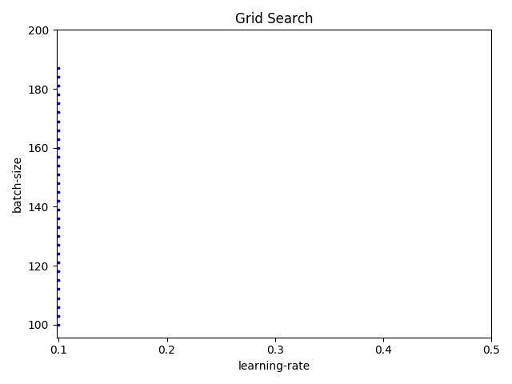

# Grid Search

Grid search is also a black box algorithm similar to Random search. 
It assumes nothing about the model and each trial can be run in parallel.

Grid search does an exhaustive search over the entire search space. 
Ideally you want the search to be uniform across your entire search space. 
The following picture shows an example search with step size 10 for the batch size.


However depending on the search space and the parameters you chose, the grid algorithm may end up not covering a lot of ground in one hyperparameter space. For example for the same example above, if you choose a step size of 3 instead of 10, you get the following coverage in 30 iterations.



So if you want a generic baseline, it is always a good idea to start with a Random search.

Now let us create a grid search experiment using Katib.

### Experiment

Let us start by creating an experiment.

<details>
<summary>
Grid search experiment
</summary>

```yaml
apiVersion: "kubeflow.org/v1alpha3"
kind: Experiment
metadata:
  namespace: kubeflow
  name: tfjob-grid
spec:
  parallelTrialCount: 3
  maxTrialCount: 12
  maxFailedTrialCount: 3
  objective:
    type: maximize
    goal: 0.99
    objectiveMetricName: accuracy_1
  algorithm:
    algorithmName: grid
  metricsCollectorSpec:
    source:
      fileSystemPath:
        path: /train
        kind: Directory
    collector:
      kind: TensorFlowEvent
  parameters:
    - name: --learning_rate
      parameterType: double
      feasibleSpace:
        min: "0.01"
        max: "0.05"
        step: "0.001"
    - name: --batch_size
      parameterType: int
      feasibleSpace:
        min: "100"
        max: "200"
        step: "20"
  trialTemplate:
    goTemplate:
        rawTemplate: |-
          apiVersion: "kubeflow.org/v1"
          kind: TFJob
          metadata:
            name: {{.Trial}}
            namespace: {{.NameSpace}}
          spec:
           tfReplicaSpecs:
            Worker:
              replicas: 1
              restartPolicy: OnFailure
              template:
                spec:
                  containers:
                    - name: tensorflow
                      image: gcr.io/kubeflow-ci/tf-mnist-with-summaries:1.0
                      imagePullPolicy: IfNotPresent
                      command:
                        - "python"
                        - "/var/tf_mnist/mnist_with_summaries.py"
                        - "--log_dir=/train/metrics"
                        {{- with .HyperParameters}}
                        {{- range .}}
                        - "{{.Name}}={{.Value}}"
                        {{- end}}
                        {{- end}}
```
</details>

There are two changes in this yaml compared to the random search. First we set `algorithmName: grid` instead of `algorithmName: random`. Second we set the step sizes using `step: "0.001"` and `step: "20"`.

Create this experiment as follows.

```console
cd $HOME/tutorial/examples/v1alpha3
kubectl apply -f tfjob-grid.yaml
 ```
 <details>
<summary>
 Sample Output
 </summary>
 
experiment.kubeflow.org/tfjob-grid created
</details>

Check that the `Experiment` **tfjob-grid** has started.

 ```console
kubectl -n kubeflow get experiment
 ```
<details>
<summary>
 Sample Output
 </summary>
NAME            STATUS    AGE
tfjob-grid   Running   98s
</details>

Check the details of the `Experiment` **tfjob-grid**

 ```console
kubectl -n kubeflow get experiment tfjob-grid -o yaml
 ```

<details>
<summary>
 Sample Output
 </summary>

```yaml
apiVersion: kubeflow.org/v1alpha3
kind: Experiment
metadata:
  annotations:
    kubectl.kubernetes.io/last-applied-configuration: |
      {"apiVersion":"kubeflow.org/v1alpha3","kind":"Experiment","metadata":{"annotations":{},"name":"tfjob-grid","namespace":"kubeflow"},"spec":{"algorithm":{"algorithmName":"grid"},"maxFailedTrialCount":3,"maxTrialCount":12,"metricsCollectorSpec":{"collector":{"kind":"TensorFlowEvent"},"source":{"fileSystemPath":{"kind":"Directory","path":"/train"}}},"objective":{"goal":0.99,"objectiveMetricName":"accuracy_1","type":"maximize"},"parallelTrialCount":3,"parameters":[{"feasibleSpace":{"max":"0.05","min":"0.01","step":"0.001"},"name":"--learning_rate","parameterType":"double"},{"feasibleSpace":{"max":"200","min":"100","step":"1"},"name":"--batch_size","parameterType":"int"}],"trialTemplate":{"goTemplate":{"rawTemplate":"apiVersion: \"kubeflow.org/v1\"\nkind: TFJob\nmetadata:\n  name: {{.Trial}}\n  namespace: {{.NameSpace}}\nspec:\n tfReplicaSpecs:\n  Worker:\n    replicas: 1 \n    restartPolicy: OnFailure\n    template:\n      spec:\n        containers:\n          - name: tensorflow \n            image: gcr.io/kubeflow-ci/tf-mnist-with-summaries:1.0\n            imagePullPolicy: IfNotPresent\n            command:\n              - \"python\"\n              - \"/var/tf_mnist/mnist_with_summaries.py\"\n              - \"--log_dir=/train/metrics\"\n              {{- with .HyperParameters}}\n              {{- range .}}\n              - \"{{.Name}}={{.Value}}\"\n              {{- end}}\n              {{- end}}"}}}}
  creationTimestamp: "2019-10-27T17:32:38Z"
  finalizers:
  - update-prometheus-metrics
  generation: 2
  name: tfjob-grid
  namespace: kubeflow
  resourceVersion: "153550"
  selfLink: /apis/kubeflow.org/v1alpha3/namespaces/kubeflow/experiments/tfjob-grid
  uid: c5934b51-f8df-11e9-88ef-080027c5bc64
spec:
  algorithm:
    algorithmName: grid
    algorithmSettings: null
  maxFailedTrialCount: 3
  maxTrialCount: 12
  metricsCollectorSpec:
    collector:
      kind: TensorFlowEvent
    source:
      fileSystemPath:
        kind: Directory
        path: /train
  objective:
    goal: 0.99
    objectiveMetricName: accuracy_1
    type: maximize
  parallelTrialCount: 3
  parameters:
  - feasibleSpace:
      max: "0.05"
      min: "0.01"
      step: "0.001"
    name: --learning_rate
    parameterType: double
  - feasibleSpace:
      max: "200"
      min: "100"
      step: "1"
    name: --batch_size
    parameterType: int
  trialTemplate:
    goTemplate:
      rawTemplate: "apiVersion: \"kubeflow.org/v1\"\nkind: TFJob\nmetadata:\n  name:
        {{.Trial}}\n  namespace: {{.NameSpace}}\nspec:\n tfReplicaSpecs:\n  Worker:\n
        \   replicas: 1 \n    restartPolicy: OnFailure\n    template:\n      spec:\n
        \       containers:\n          - name: tensorflow \n            image: gcr.io/kubeflow-ci/tf-mnist-with-summaries:1.0\n
        \           imagePullPolicy: IfNotPresent\n            command:\n              -
        \"python\"\n              - \"/var/tf_mnist/mnist_with_summaries.py\"\n              -
        \"--log_dir=/train/metrics\"\n              {{- with .HyperParameters}}\n
        \             {{- range .}}\n              - \"{{.Name}}={{.Value}}\"\n              {{-
        end}}\n              {{- end}}"
status:
  completionTime: "2019-10-27T17:42:37Z"
  conditions:
  - lastTransitionTime: "2019-10-27T17:32:38Z"
    lastUpdateTime: "2019-10-27T17:32:38Z"
    message: Experiment is created
    reason: ExperimentCreated
    status: "True"
    type: Created
  - lastTransitionTime: "2019-10-27T17:42:37Z"
    lastUpdateTime: "2019-10-27T17:42:37Z"
    message: Experiment is running
    reason: ExperimentRunning
    status: "False"
    type: Running
  - lastTransitionTime: "2019-10-27T17:42:37Z"
    lastUpdateTime: "2019-10-27T17:42:37Z"
    message: Experiment has succeeded because max trial count has reached
    reason: ExperimentSucceeded
    status: "True"
    type: Succeeded
  currentOptimalTrial:
    observation:
      metrics:
      - name: accuracy_1
        value: 0.970499992371
    parameterAssignments:
    - name: --learning_rate
      value: "0.01"
    - name: --batch_size
      value: "110"
  startTime: "2019-10-27T17:32:38Z"
  trials: 12
  trialsSucceeded: 12
  ```

</details>
