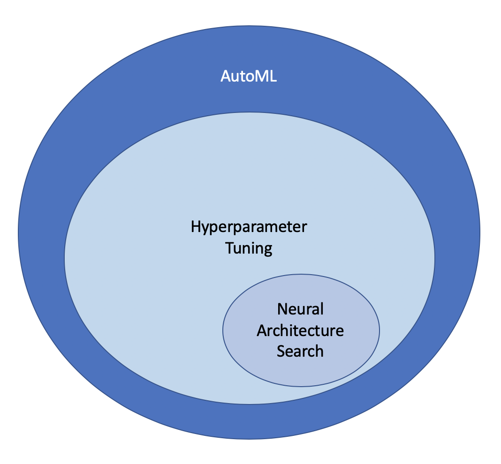

# Katib

Katib is a scalable and extensible `Automatic Machine Learning`(AutoML) framework on Kubernetes. It supports Hyperparameter tuning and neural architecture search. It enables users to discover models that are as good as hand-crafted models, without having to go through the laborious process of manual configuration and iteration.

Katib organizes an optimization or neural architecture search as an `Experiment`. 
AutoML algorithms run in an interactive manner. An `Experiment` defines the search space, metrics target and maximum number of iterations. Katib searches iteratively in the search space to meet the metrics target or for the maximum number of iterations.
Katib supports two different mechanisms for AutoML - Hyperparameter Tuning and Neural Architecture Search.

## Etymology

Katib stands for `secretary` in Arabic. As `Vizier` stands for a high official or a prime minister in Arabic, this project Katib is named in the honor of [Vizier](https://ai.google/research/pubs/pub46180).

## Hyperparameter Tuning

Hyperparameter tuning finds the optimal hyperparameter vector for a given model architecture. In each iteration Katib uses a `Suggestion` algorithm to generate a candidate hyperparameter vector. The candidate hyperparameters are given to a `Trial` that provides training and validation services. The metrics collected from that trial are fed into the `Suggestion` algorithm to generate the candidate vector for the next iteration. This process continues till we reach the desired metric goal or the maximum number of iterations if complete.

In this tutorial we will focus on Hyperparameter tuning.

## Neural Architecture Search

Neural Architecture Search finds the optimal neural architecture for a given data set.

