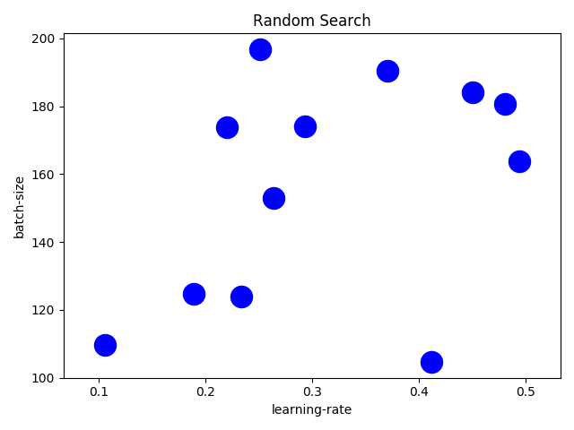
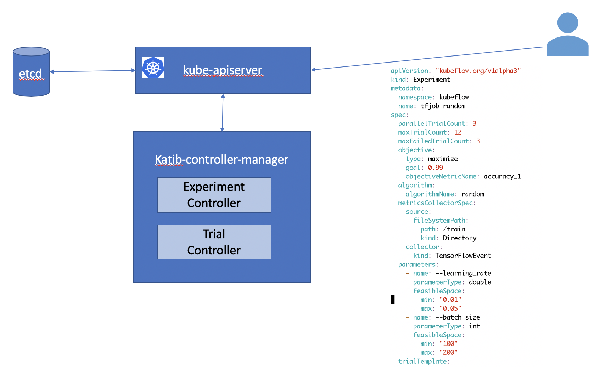
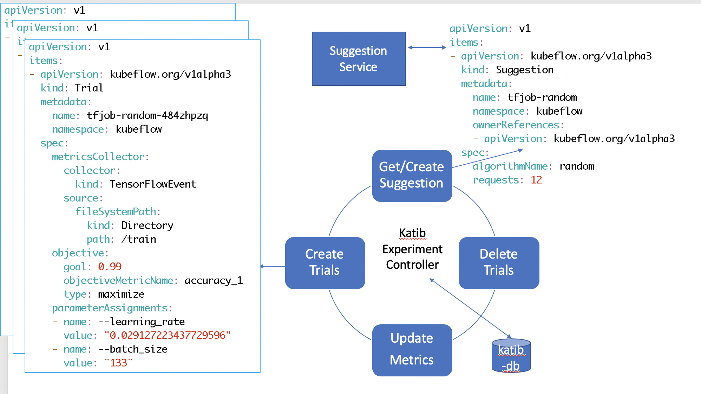
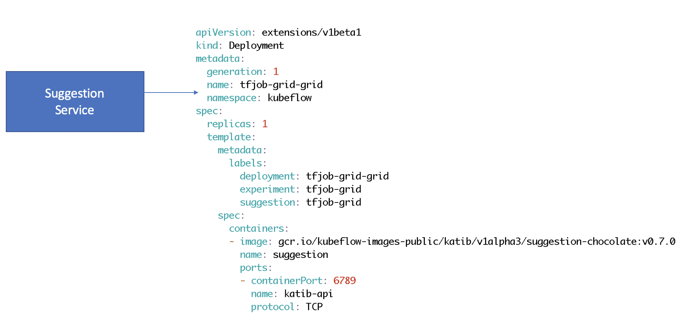
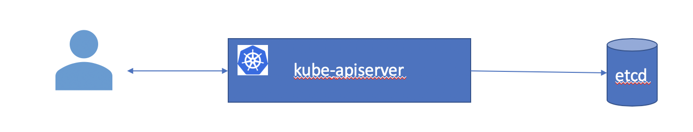
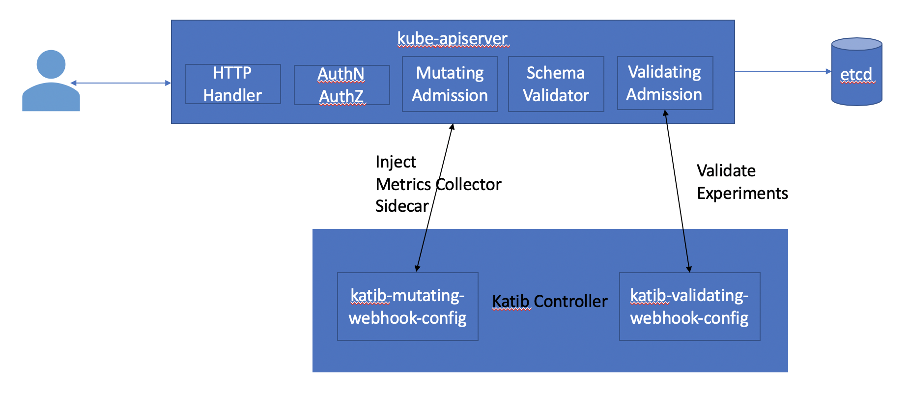

# Random Search

Random search is a black box algorithm for searching for an optimal hyperparameter vector.
It assumes nothing about the model and each trial can be run parallellty.

Random search selects points at random from the entire search space. 



Random search provides a good coverage for multiple hyperparameters in the search space.
If you want a generic baseline, it is always a good idea to start with a Random search.

Now let us create a random search experiment using Katib.

### Experiment
Let us start by creating an experiment.

<details>
<summary>
Random search experiment
</summary>

```yaml
apiVersion: "kubeflow.org/v1alpha3"
kind: Experiment
metadata:
  namespace: kubeflow
  name: tfjob-random
spec:
  parallelTrialCount: 3
  maxTrialCount: 12
  maxFailedTrialCount: 3
  objective:
    type: maximize
    goal: 0.99
    objectiveMetricName: accuracy_1
  algorithm:
    algorithmName: random
  metricsCollectorSpec:
    source:
      fileSystemPath:
        path: /train
        kind: Directory
    collector:
      kind: TensorFlowEvent
  parameters:
    - name: --learning_rate
      parameterType: double
      feasibleSpace:
        min: "0.01"
        max: "0.05"
    - name: --batch_size
      parameterType: int
      feasibleSpace:
        min: "100"
        max: "200"
  trialTemplate:
    goTemplate:
        rawTemplate: |-
          apiVersion: "kubeflow.org/v1"
          kind: TFJob
          metadata:
            name: {{.Trial}}
            namespace: {{.NameSpace}}
          spec:
           tfReplicaSpecs:
            Worker:
              replicas: 1
              restartPolicy: OnFailure
              template:
                spec:
                  containers:
                    - name: tensorflow
                      image: gcr.io/kubeflow-ci/tf-mnist-with-summaries:1.0
                      imagePullPolicy: IfNotPresent
                      command:
                        - "python"
                        - "/var/tf_mnist/mnist_with_summaries.py"
                        - "--log_dir=/train/metrics"
                        {{- with .HyperParameters}}
                        {{- range .}}
                        - "{{.Name}}={{.Value}}"
                        {{- end}}
                        {{- end}}
```
</details>



```console
cd $HOME/tutorial/examples/v1alpha3
kubectl apply -f tfjob-random.yaml
 ```
 <details>
<summary>
 Sample Output
 </summary>
experiment.kubeflow.org/tfjob-random created
</details>

Check that the `Experiment` **tfjob-random** has started.

 ```console
kubectl -n kubeflow get experiment
 ```

<details>
<summary>
 Sample Output
 </summary>
NAME            STATUS    AGE
tfjob-random   Running   98s
</details>

Check the details of the `Experiment` **tfjob-random**

 ```console
kubectl -n kubeflow get experiment tfjob-random -o json
 ```

<details>
<summary>
 Sample Output
 </summary>

```json
{
    "apiVersion": "kubeflow.org/v1alpha3",
    "kind": "Experiment",
    "metadata": {
        "annotations": {
            "kubectl.kubernetes.io/last-applied-configuration": "{\"apiVersion\":\"kubeflow.org/v1alpha3\",\"kind\":\"Experiment\",\"metadata\":{\"annotations\":{},\"name\":\"tfjob-random\",\"namespace\":\"kubeflow\"},\"spec\":{\"algorithm\":{\"algorithmName\":\"random\"},\"maxFailedTrialCount\":3,\"maxTrialCount\":12,\"metricsCollectorSpec\":{\"collector\":{\"kind\":\"TensorFlowEvent\"},\"source\":{\"fileSystemPath\":{\"kind\":\"Directory\",\"path\":\"/train\"}}},\"objective\":{\"goal\":0.99,\"objectiveMetricName\":\"accuracy_1\",\"type\":\"maximize\"},\"parallelTrialCount\":3,\"parameters\":[{\"feasibleSpace\":{\"max\":\"0.05\",\"min\":\"0.01\"},\"name\":\"--learning_rate\",\"parameterType\":\"double\"},{\"feasibleSpace\":{\"max\":\"200\",\"min\":\"100\"},\"name\":\"--batch_size\",\"parameterType\":\"int\"}],\"trialTemplate\":{\"goTemplate\":{\"rawTemplate\":\"apiVersion: \\\"kubeflow.org/v1\\\"\\nkind: TFJob\\nmetadata:\\n  name: {{.Trial}}\\n  namespace: {{.NameSpace}}\\nspec:\\n tfReplicaSpecs:\\n  Worker:\\n    replicas: 1 \\n    restartPolicy: OnFailure\\n    template:\\n      spec:\\n        containers:\\n          - name: tensorflow \\n            image: gcr.io/kubeflow-ci/tf-mnist-with-summaries:1.0\\n            imagePullPolicy: IfNotPresent\\n            command:\\n              - \\\"python\\\"\\n              - \\\"/var/tf_mnist/mnist_with_summaries.py\\\"\\n              - \\\"--log_dir=/train/metrics\\\"\\n              {{- with .HyperParameters}}\\n              {{- range .}}\\n              - \\\"{{.Name}}={{.Value}}\\\"\\n              {{- end}}\\n              {{- end}}\"}}}}\n"
        },
        "creationTimestamp": "2019-10-27T02:46:02Z",
        "finalizers": [
            "update-prometheus-metrics"
        ],
        "generation": 2,
        "name": "tfjob-random",
        "namespace": "kubeflow",
        "resourceVersion": "21979",
        "selfLink": "/apis/kubeflow.org/v1alpha3/namespaces/kubeflow/experiments/tfjob-random",
        "uid": "e9f888cb-f863-11e9-88ef-080027c5bc64"
    },
    "spec": {
        "algorithm": {
            "algorithmName": "random",
            "algorithmSettings": null
        },
        "maxFailedTrialCount": 3,
        "maxTrialCount": 12,
        "metricsCollectorSpec": {
            "collector": {
                "kind": "TensorFlowEvent"
            },
            "source": {
                "fileSystemPath": {
                    "kind": "Directory",
                    "path": "/train"
                }
            }
        },
        "objective": {
            "goal": 0.99,
            "objectiveMetricName": "accuracy_1",
            "type": "maximize"
        },
        "parallelTrialCount": 3,
        "parameters": [
            {
                "feasibleSpace": {
                    "max": "0.05",
                    "min": "0.01"
                },
                "name": "--learning_rate",
                "parameterType": "double"
            },
            {
                "feasibleSpace": {
                    "max": "200",
                    "min": "100"
                },
                "name": "--batch_size",
                "parameterType": "int"
            }
        ],
        "trialTemplate": {
            "goTemplate": {
                "rawTemplate": "apiVersion: \"kubeflow.org/v1\"\nkind: TFJob\nmetadata:\n  name: {{.Trial}}\n  namespace: {{.NameSpace}}\nspec:\n tfReplicaSpecs:\n  Worker:\n    replicas: 1 \n    restartPolicy: OnFailure\n    template:\n      spec:\n        containers:\n          - name: tensorflow \n            image: gcr.io/kubeflow-ci/tf-mnist-with-summaries:1.0\n            imagePullPolicy: IfNotPresent\n            command:\n              - \"python\"\n              - \"/var/tf_mnist/mnist_with_summaries.py\"\n              - \"--log_dir=/train/metrics\"\n              {{- with .HyperParameters}}\n              {{- range .}}\n              - \"{{.Name}}={{.Value}}\"\n              {{- end}}\n              {{- end}}"
            }
        }
    },
    "status": {
        "completionTime": null,
        "conditions": [
            {
                "lastTransitionTime": "2019-10-27T02:46:02Z",
                "lastUpdateTime": "2019-10-27T02:46:02Z",
                "message": "Experiment is created",
                "reason": "ExperimentCreated",
                "status": "True",
                "type": "Created"
            }
        ],
        "currentOptimalTrial": {
            "observation": {
                "metrics": null
            },
            "parameterAssignments": null
        },
        "startTime": "2019-10-27T02:46:02Z"
    }
}
```

</details>

Under the hood, Katib controller is looping in a reconcile loop to satisfy this `Experiment` request.



### Suggestions
You can see Katib creating `Suggestions` using the `random` algorithm.
 ```console
kubectl -n kubeflow  get suggestions tfjob-random -o yaml
```

<details>
<summary>
 Sample Output - before suggestions are ready
 </summary>

```yaml
apiVersion: kubeflow.org/v1alpha3
kind: Suggestion
metadata:
  creationTimestamp: "2019-10-27T02:57:58Z"
  generation: 1
  name: tfjob-random
  namespace: kubeflow
  ownerReferences:
  - apiVersion: kubeflow.org/v1alpha3
    blockOwnerDeletion: true
    controller: true
    kind: Experiment
    name: tfjob-random
    uid: 94e07a51-f865-11e9-88ef-080027c5bc64
  resourceVersion: "24296"
  selfLink: /apis/kubeflow.org/v1alpha3/namespaces/kubeflow/suggestions/tfjob-random
  uid: 94e5930d-f865-11e9-88ef-080027c5bc64
spec:
  algorithmName: random
  requests: 3
status:
  conditions:
  - lastTransitionTime: "2019-10-27T02:57:58Z"
    lastUpdateTime: "2019-10-27T02:57:58Z"
    message: Suggestion is created
    reason: SuggestionCreated
    status: "True"
    type: Created
  - lastTransitionTime: "2019-10-27T02:57:58Z"
    lastUpdateTime: "2019-10-27T02:57:58Z"
    message: Deployment is not ready
    reason: DeploymentNotReady
    status: "False"
    type: DeploymentReady
  startTime: "2019-10-27T02:57:58Z"
```

</details>

We now have a `Suggestion` resource created. The Katib Suggestion Service takes control and generates a deployment to run the specified Suggestion.


The suggestion service provides suggestions based on the current state of the system. On each new suggestion request, it reevaluates and provides the next best set of suggestions.

<details>
<summary>
 Sample Output - after suggestions are ready
 </summary>

```yaml
apiVersion: v1
items:
- apiVersion: kubeflow.org/v1alpha3
  kind: Suggestion
  metadata:
    creationTimestamp: "2019-10-27T02:57:58Z"
    generation: 10
    name: tfjob-random
    namespace: kubeflow
    ownerReferences:
    - apiVersion: kubeflow.org/v1alpha3
      blockOwnerDeletion: true
      controller: true
      kind: Experiment
      name: tfjob-random
      uid: 94e07a51-f865-11e9-88ef-080027c5bc64
    resourceVersion: "25675"
    selfLink: /apis/kubeflow.org/v1alpha3/namespaces/kubeflow/suggestions/tfjob-random
    uid: 94e5930d-f865-11e9-88ef-080027c5bc64
  spec:
    algorithmName: random
    requests: 12
  status:
    conditions:
    - lastTransitionTime: "2019-10-27T02:57:58Z"
      lastUpdateTime: "2019-10-27T02:57:58Z"
      message: Suggestion is created
      reason: SuggestionCreated
      status: "True"
      type: Created
    - lastTransitionTime: "2019-10-27T02:58:16Z"
      lastUpdateTime: "2019-10-27T02:58:16Z"
      message: Deployment is ready
      reason: DeploymentReady
      status: "True"
      type: DeploymentReady
    - lastTransitionTime: "2019-10-27T02:59:16Z"
      lastUpdateTime: "2019-10-27T02:59:16Z"
      message: Suggestion is running
      reason: SuggestionRunning
      status: "True"
      type: Running
    startTime: "2019-10-27T02:57:58Z"
    suggestionCount: 12
    suggestions:
    - name: tfjob-random-npjpbgmd
      parameterAssignments:
      - name: --learning_rate
        value: "0.03684477847537918"
      - name: --batch_size
        value: "112"
    - name: tfjob-random-mmc8dqvq
      parameterAssignments:
      - name: --learning_rate
        value: "0.010960280128777096"
      - name: --batch_size
        value: "126"
    - name: tfjob-random-6h7229dt
      parameterAssignments:
      - name: --learning_rate
        value: "0.011672960430260329"
      - name: --batch_size
        value: "181"
    - name: tfjob-random-hfzrfh8j
      parameterAssignments:
      - name: --learning_rate
        value: "0.03510831325099869"
      - name: --batch_size
        value: "156"
    - name: tfjob-random-7kg9zhrt
      parameterAssignments:
      - name: --learning_rate
        value: "0.02709470325001432"
      - name: --batch_size
        value: "157"
    - name: tfjob-random-gng5qx9x
      parameterAssignments:
      - name: --learning_rate
        value: "0.021854230935173045"
      - name: --batch_size
        value: "148"
    - name: tfjob-random-5sfxkhmc
      parameterAssignments:
      - name: --learning_rate
        value: "0.011053371330636894"
      - name: --batch_size
        value: "131"
    - name: tfjob-random-7bzhkvvd
      parameterAssignments:
      - name: --learning_rate
        value: "0.039025808494984444"
      - name: --batch_size
        value: "139"
    - name: tfjob-random-xjm458qc
      parameterAssignments:
      - name: --learning_rate
        value: "0.023093126743054533"
      - name: --batch_size
        value: "105"
    - name: tfjob-random-zb89h929
      parameterAssignments:
      - name: --learning_rate
        value: "0.017877859019641958"
      - name: --batch_size
        value: "192"
    - name: tfjob-random-wqglhpqj
      parameterAssignments:
      - name: --learning_rate
        value: "0.018670804338535255"
      - name: --batch_size
        value: "191"
    - name: tfjob-random-484zhpzq
      parameterAssignments:
      - name: --learning_rate
        value: "0.029127223437729596"
      - name: --batch_size
        value: "133"
```
</details>

### Trials
Once the suggestions are ready, Katib Trail controller is ready to run the trials.
Each `Trial` evaluates the performance for the suggested hyperparameter vector and records the performance in the metric collector.


You can see Katib creating multiple `Trials`.

 ```console
kubectl -n kubeflow get trials
```
<details>
<summary>
 Sample Output
 </summary>
NAME                    TYPE      STATUS   AGE
tfjob-random-5xq64qwz   Created   True     25s
tfjob-random-h9l2h54d   Created   True     25s
tfjob-random-pf5htw5f   Created   True     25s
</details>

TFJob trial creates a pod to run the trial.

 ```console
kubectl -n kubeflow get po -l controller-name=tf-operator
```
<details>
<summary>
 Sample Output
 </summary>

```
NAME                             READY   STATUS    RESTARTS   AGE
tfjob-random-484zhpzq-worker-0   2/2     Running   0          39s
tfjob-random-wqglhpqj-worker-0   2/2     Running   0          40s
tfjob-random-zb89h929-worker-0   2/2     Running   0          41s
```

</details>

### Metric Collection

When we talked about the Kubernetes architecture we briefly mentioned how a user creates resources using the Kubernetes API server and how the Kubernetes API server stores this data in etcd.



In reality, there are several stages between the Kubernetes API server receiving a request before it is accepted.
In particular, there are two common extension points where external controllers can do additional tasks. These are mutating admission controllers and validating admission controllers.
Katib controller registers itself as both a mutating and validating controller.



You can see the webhooks as follows.

```console
kubectl get MutatingWebhookConfiguration
```
<details>
<summary>
 Sample Output
 </summary>

```
NAME                            CREATED AT
katib-mutating-webhook-config   2019-10-26T21:00:30Z
```

</details>

```console
kubectl get ValidatingWebhookConfiguration
```
<details>
<summary>
 Sample Output
 </summary>

```
NAME                              CREATED AT
katib-validating-webhook-config   2019-10-26T21:00:30Z
```

</details>

The mutating webhook looks at Katib configuration and injects a side car container to the `Trial` jobs/pods. You can see the configurations as follows.

```console
kubectl -n kubeflow get cm katib-config -o yaml
```
<details>
<summary>
 Sample Output
 </summary>

```yaml
 apiVersion: v1
data:
  metrics-collector-sidecar: |-
    {
      "StdOut": {
              "image": "gcr.io/kubeflow-images-public/katib/v1alpha3/file-metrics-collector:v0.7.0"
      },
      "File": {
              "image": "gcr.io/kubeflow-images-public/katib/v1alpha3/file-metrics-collector:v0.7.0"
      },
      "TensorFlowEvent": {
              "image": "gcr.io/kubeflow-images-public/katib/v1alpha3/tfevent-metrics-collector:v0.7.0"
      }
    }
  suggestion: |-
    {
      "random": {
              "image": "gcr.io/kubeflow-images-public/katib/v1alpha3/suggestion-hyperopt:v0.7.0"
      },
      "grid": {
              "image": "gcr.io/kubeflow-images-public/katib/v1alpha3/suggestion-chocolate:v0.7.0"
      },
      "hyperband": {
              "image": "gcr.io/kubeflow-images-public/katib/v1alpha3/suggestion-hyperband:v0.7.0"
      },
      "bayesianoptimization": {
              "image": "gcr.io/kubeflow-images-public/katib/v1alpha3/suggestion-skopt:v0.7.0"
      },
      "tpe": {
              "image": "gcr.io/kubeflow-images-public/katib/v1alpha3/suggestion-hyperopt:v0.7.0"
      },
      "nasrl": {
              "image": "gcr.io/kubeflow-images-public/katib/v1alpha3/suggestion-nasrl:v0.7.0"
      }
    }
kind: ConfigMap
```

 </details>

### Experiment Completion

Once the Trials created by Katib are complete, the Experiment enters a completed state.
Check the completion status of the `Experiment` **tfjob-example**

 ```console
kubectl -n kubeflow get experiment tfjob-random -o json
 ```

<details>
<summary>
 Sample Output
 </summary>
 
 </details>

 You can observe the status of this experiment under the `status` field of the output.

 You can also see that Katib has cleaned up the `Trial` worker pods.
 ```console
kubectl -n kubeflow get pods
```

<details>

<summary>
 Sample Output
 </summary>

```
 NAME                                    READY   STATUS    RESTARTS   AGE
katib-controller-7665868558-nfghw       1/1     Running   1          21m
katib-db-594756f779-dxttq               1/1     Running   0          21m
katib-manager-769b7bcbfb-7vvgx          1/1     Running   0          21m
katib-ui-854969c97-tl4wg                1/1     Running   0          21m
pytorch-operator-794899d49b-ww59g       1/1     Running   0          21m
tf-job-operator-7b589f5f5f-fpr2p        1/1     Running   0          21m
tfjob-example-random-6d68b59ccd-fcn8f   1/1     Running   0          15m
```

</details>
