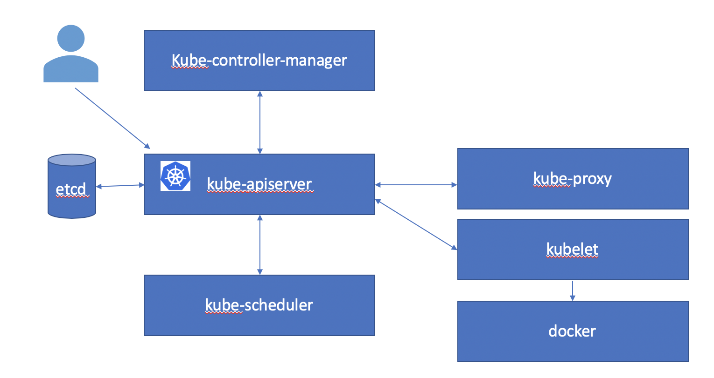
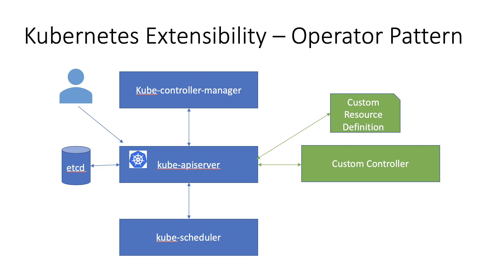

# Kubernetes Architecture

A Kubernetes cluster consists of some master components and some worker components. 
In a single node Kubernetes cluster, master and worker components may run on the same node.
In a production Kubernetes cluster you typically have one or more master nodes and many worker nodes.



Kubernetes API server is the primary interface to an end user - either using kubectl or client-go or an application using the Kubernetes API.

Kubernetes API server manages versioned resources. You can add new resource types to a Kubernetes API server.
Pods, Deployments, Services are examples on built in resources or `Kinds`. In this tutorial we will be working with custom resources like `Experiments`, `Suggestions` and `Trials`. Resources are grouped together into API groups and are versioned.

You can explore the API groups and resources available on your Kubernetes cluster as follows.

```console
kubectl api-versions
```
<details>
<summary>
 Sample Output
 </summary>
 admissionregistration.k8s.io/v1beta1
apiextensions.k8s.io/v1beta1
apiregistration.k8s.io/v1
apiregistration.k8s.io/v1beta1
apps/v1
apps/v1beta1
apps/v1beta2
authentication.k8s.io/v1
authentication.k8s.io/v1beta1
authorization.k8s.io/v1
authorization.k8s.io/v1beta1
autoscaling/v1
autoscaling/v2beta1
autoscaling/v2beta2
batch/v1
batch/v1beta1
certificates.k8s.io/v1beta1
coordination.k8s.io/v1
coordination.k8s.io/v1beta1
events.k8s.io/v1beta1
extensions/v1beta1
kubeflow.org/v1
kubeflow.org/v1alpha3
networking.k8s.io/v1
networking.k8s.io/v1beta1
node.k8s.io/v1beta1
policy/v1beta1
rbac.authorization.k8s.io/v1
rbac.authorization.k8s.io/v1beta1
scheduling.k8s.io/v1
scheduling.k8s.io/v1beta1
storage.k8s.io/v1
storage.k8s.io/v1beta1
v1
 </details>

You can see the available Kubernetes resources(`Kinds`) as follows.
```console
kubectl api-resources
```
<details>
<summary>
 Sample Output
 </summary>
 NAME                              SHORTNAMES   APIGROUP                       NAMESPACED   KIND
bindings                                                                      true         Binding
componentstatuses                 cs                                          false        ComponentStatus
configmaps                        cm                                          true         ConfigMap
endpoints                         ep                                          true         Endpoints
events                            ev                                          true         Event
limitranges                       limits                                      true         LimitRange
namespaces                        ns                                          false        Namespace
nodes                             no                                          false        Node
persistentvolumeclaims            pvc                                         true         PersistentVolumeClaim
persistentvolumes                 pv                                          false        PersistentVolume
pods                              po                                          true         Pod
podtemplates                                                                  true         PodTemplate
replicationcontrollers            rc                                          true         ReplicationController
resourcequotas                    quota                                       true         ResourceQuota
secrets                                                                       true         Secret
serviceaccounts                   sa                                          true         ServiceAccount
services                          svc                                         true         Service
mutatingwebhookconfigurations                  admissionregistration.k8s.io   false        MutatingWebhookConfiguration
validatingwebhookconfigurations                admissionregistration.k8s.io   false        ValidatingWebhookConfiguration
customresourcedefinitions         crd,crds     apiextensions.k8s.io           false        CustomResourceDefinition
apiservices                                    apiregistration.k8s.io         false        APIService
controllerrevisions                            apps                           true         ControllerRevision
daemonsets                        ds           apps                           true         DaemonSet
deployments                       deploy       apps                           true         Deployment
replicasets                       rs           apps                           true         ReplicaSet
statefulsets                      sts          apps                           true         StatefulSet
tokenreviews                                   authentication.k8s.io          false        TokenReview
localsubjectaccessreviews                      authorization.k8s.io           true         LocalSubjectAccessReview
selfsubjectaccessreviews                       authorization.k8s.io           false        SelfSubjectAccessReview
selfsubjectrulesreviews                        authorization.k8s.io           false        SelfSubjectRulesReview
subjectaccessreviews                           authorization.k8s.io           false        SubjectAccessReview
horizontalpodautoscalers          hpa          autoscaling                    true         HorizontalPodAutoscaler
cronjobs                          cj           batch                          true         CronJob
jobs                                           batch                          true         Job
certificatesigningrequests        csr          certificates.k8s.io            false        CertificateSigningRequest
leases                                         coordination.k8s.io            true         Lease
events                            ev           events.k8s.io                  true         Event
daemonsets                        ds           extensions                     true         DaemonSet
deployments                       deploy       extensions                     true         Deployment
ingresses                         ing          extensions                     true         Ingress
networkpolicies                   netpol       extensions                     true         NetworkPolicy
podsecuritypolicies               psp          extensions                     false        PodSecurityPolicy
replicasets                       rs           extensions                     true         ReplicaSet
experiments                                    kubeflow.org                   true         Experiment
pytorchjobs                                    kubeflow.org                   true         PyTorchJob
suggestions                                    kubeflow.org                   true         Suggestion
tfjobs                                         kubeflow.org                   true         TFJob
trials                                         kubeflow.org                   true         Trial
ingresses                         ing          networking.k8s.io              true         Ingress
networkpolicies                   netpol       networking.k8s.io              true         NetworkPolicy
runtimeclasses                                 node.k8s.io                    false        RuntimeClass
poddisruptionbudgets              pdb          policy                         true         PodDisruptionBudget
podsecuritypolicies               psp          policy                         false        PodSecurityPolicy
clusterrolebindings                            rbac.authorization.k8s.io      false        ClusterRoleBinding
clusterroles                                   rbac.authorization.k8s.io      false        ClusterRole
rolebindings                                   rbac.authorization.k8s.io      true         RoleBinding
roles                                          rbac.authorization.k8s.io      true         Role
priorityclasses                   pc           scheduling.k8s.io              false        PriorityClass
csidrivers                                     storage.k8s.io                 false        CSIDriver
csinodes                                       storage.k8s.io                 false        CSINode
storageclasses                    sc           storage.k8s.io                 false        StorageClass
volumeattachments                              storage.k8s.io                 false        VolumeAttachment
</details>

Kubernetes supports [various](https://kubernetes.io/docs/concepts/extend-kubernetes/extend-cluster/) types of extension capabilities at all layers, starting with the API server, scheduler, controllers all the way to the kubelet. One of the common patterns used to add new resources and capabilities to the Kubernetes API server is called the Operator Pattern. This consists of creating a custom resource(`Kind`) and a controller that manages this custom resource.
Kubeflow and Katib use this extensively. This allows Kubeflow and Katib to be integrated with Kubernetes. You can manage and interact with Kubeflow and Katib components just as you interact with any other Kubernetes component!



You can see the available Kubernetes custom resource definitions as follows.
```console
kubectl get crds
```
<details>
<summary>
 Sample Output
 </summary>
 NAME                       CREATED AT
experiments.kubeflow.org   2019-10-26T21:00:25Z
pytorchjobs.kubeflow.org   2019-10-26T21:00:27Z
suggestions.kubeflow.org   2019-10-26T21:00:25Z
tfjobs.kubeflow.org        2019-10-26T21:00:27Z
trials.kubeflow.org        2019-10-26T21:00:25Z
</details>