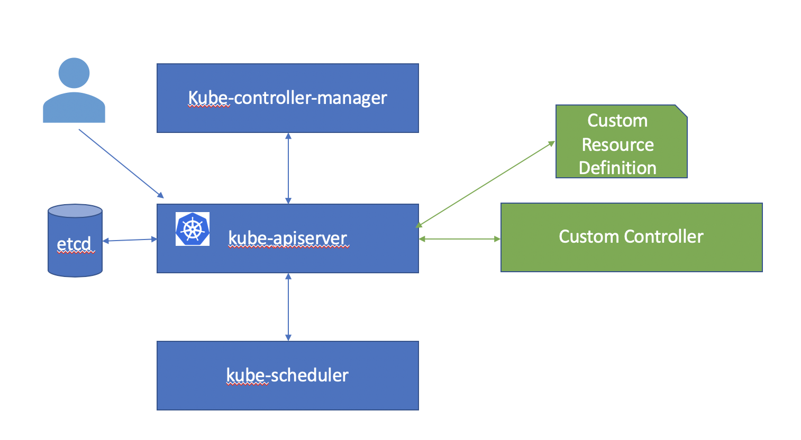

# Kubernetes Architecture

A Kubernetes cluster consists of some master components and some worker components. 
In the single node Kubernetes cluster the master and worker components may run on the same node.
In a production Kubernetes cluster you typically have one or more master nodes and many worker nodes.

Add GVK

Kubernetes API server has been designed to be extensible. There are three primary mechanisms to extend Kubernetes - 
* Plugins
* API Aggregators
* Custom Resources

